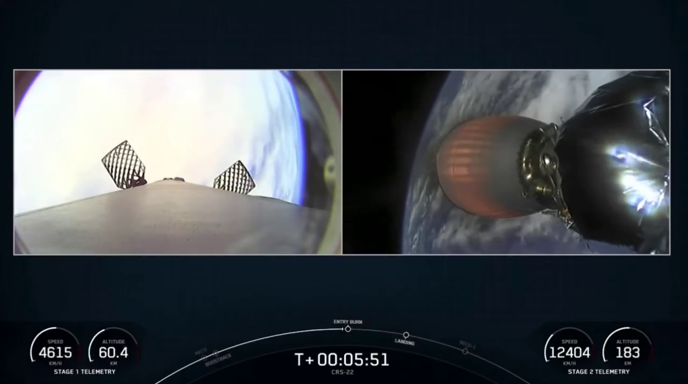
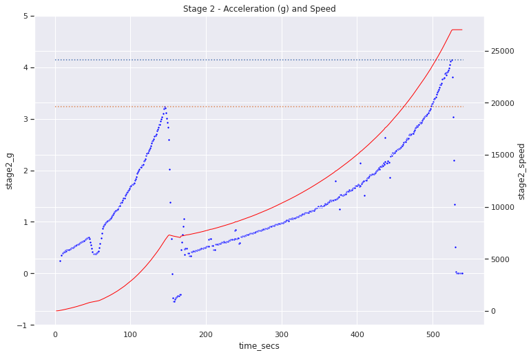
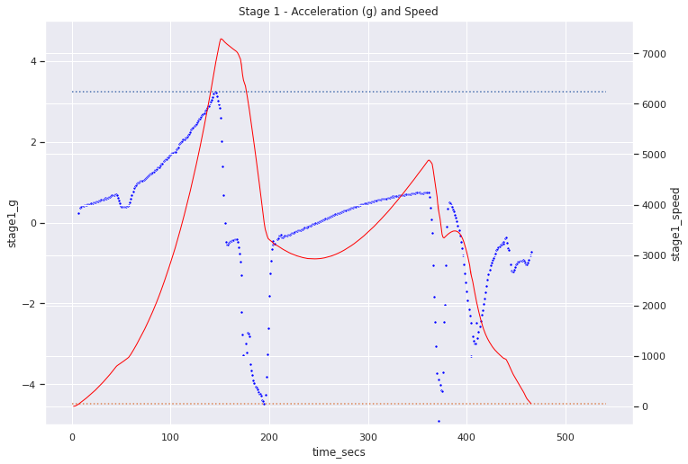
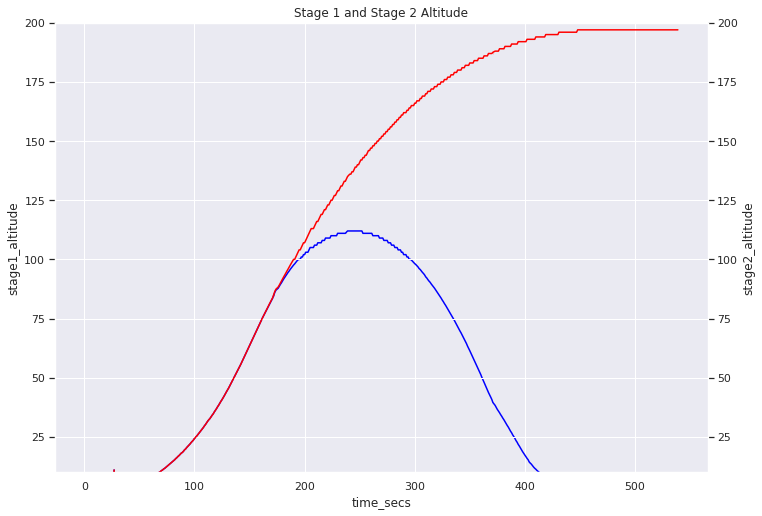

## How much g-force will you experience in a SpaceX Falcon-9 launch?

- Have you ever wondered how many [g-force](https://en.wikipedia.org/wiki/G-force) you would experience sitting on [SpaceX Falcon-9](https://www.spacex.com/vehicles/falcon-9/)? 
- Will you experience more gs accending or descending? 
- While powered by stage-1's 9 Merlin engines screaming or on stage-2 trying to hit the orbital velocity?

If you wanted the answers, here is a hacker project that can answer it all.

### Answers First

I analyzed the recent [SpaceX CRS-22](https://en.wikipedia.org/wiki/SpaceX_CRS-22) which delivered cargo including solar panels to the International Space Station.

There were two major surprises for me.
1. While ascending you will experience more g-forces (4.1g) when while powered by Stage-2 (when approaching escape velocity) than from Stage-1 (3.2g just before stage separation).

2. On Stage-1 you will experience maximum g-force (-4.5g) descending (just when engines fire back to slow the descent). No crew is onboard at this time and this probably also give one more reason to why SpaceX Starship uses drag to slow down a lot before firing the engines.

### Interesting Observations

1. Do you remember how just before Max-Q sometimes SpaceX mentions they are throttling down? You can see that moment very clearly on the stage1-g chart around 40 seconds where acceleration drops a bit.

2. When the stage1 engine shut off will you experience -1g force from earth's gravity? The measurments show only -0.6g. The 0.4g reduction is due to centrifugal force generated by 4000 kmph tangential (horizontal) velocity. For us to experience zero gravity [weightlessness](https://en.wikipedia.org/wiki/Weightlessness) we need Stage2 to propel us to 27,000 kmph in next 400 seconds.

3. Notice the U in stage1 velocity between 200 and 300 seconds from launch? Also, the g chart is a bit weird going from -0.6g to +0.xg. What is going on?
This is better explained by the altitude chart below. Upto about 250 seconds or so the stage-1 is still ascending hence the gravity is opposing it (hence negative), once it hits the top of the parabolla on altitude chart it starts descending and gravity starts speeding the stage1 again!.

### How to do it yourself

[This](https://github.com/sjamthe/spacex-launch-analysis/blob/main/spacex_launch_parser.ipynb) colab will walk you through all the steps if you want to repeat this yourself or want to do it for another SpaceX launch. Here are the steps

1. Identify a SpaceX launch video that shows complete launch with telematics. I chose [this](https://www.youtube.com/watch?v=cYTTKfMKdGg) video for CRS-22 launch as this already trips pre-launch announcements. (If you choose a complete launch announcement video it will be too long and you will need to skip a lot.)
2. Colab uses Google Drive to as a temporary space to download the video and extract images. This is better than using temporary space on colab as you will loose your data if you get disconnected in the middle.
3. I use [pytube](https://pytube.io/en/latest/) to download the video. YouTube supports multiple streams, the Colab shows how to download 720p stream for better picture clarity.
4. Next step is to extract images from the video. Though the video contains 30 frames per second, I am extracting only one frame per second to save space and processing time. It seems to give enough accuracy to calculate g-force. Colab let's you decide number of frames you want to skip. All the frames are extracted on same Google Drive folder.
5. We will use [EasyOCR](https://github.com/JaidedAI/EasyOCR) python package to read the telematics from the images. Though the software can read entire image I found it to work much better if you crop the image before you feed it to OCR. As the telematics numbers are always shown on the same place in all frames, this step helps us test out the five images we are going to crop out from the main image. The six images are stage1_speed, stage1_altitude, stage2_speed, stage2_altitude, minutes and seconds from count down clock. The complete launch takes less than 10 minutes so no need for the hour number for now.
6. With the six cropping rectangle coordinates identified we are ready to loop through all images, crop them and feed to EasyOCR. As EasyOCR runs far better with GPU this is a good time to change your colab runtime and add a GPU. Note: This resets your python variables so you will have to reconnect with your GDrive. (Good thing we saved all the images).
7. After a few minutes we should have an array of all the telematics. We will pickle these results to GDrive so we can release the GPU and play with the numbers at leasure. [Here](crs-22-results.p) is CRS-22 pickled results file.
8. Last step is to scrub the data for outliers/bad OCR readings and perform high school physics to get acceleration!

Enjoy!

